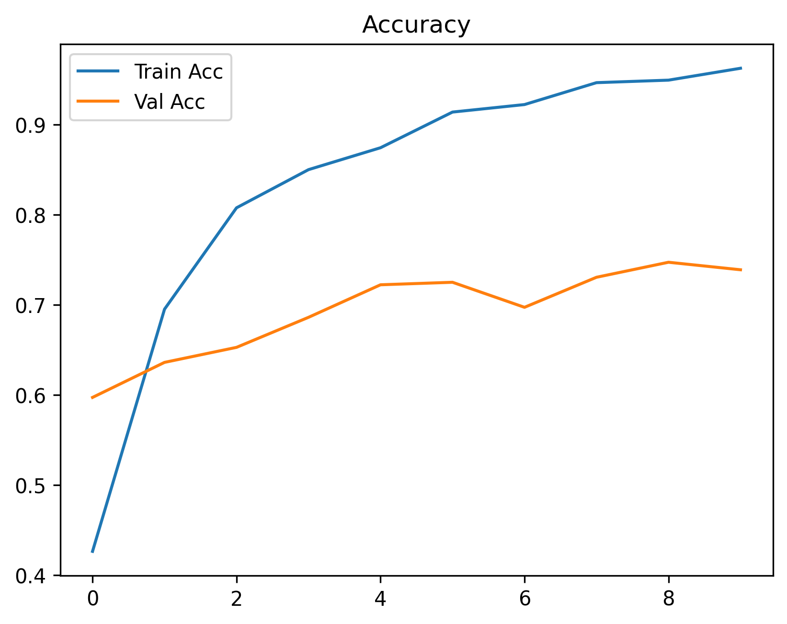
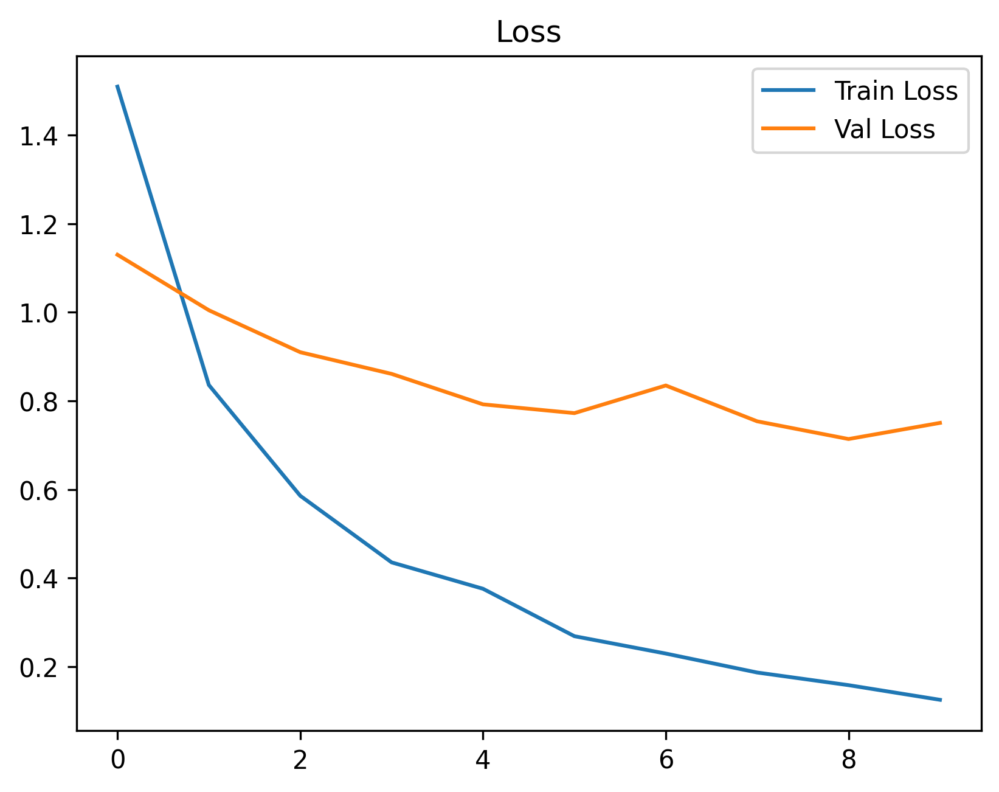
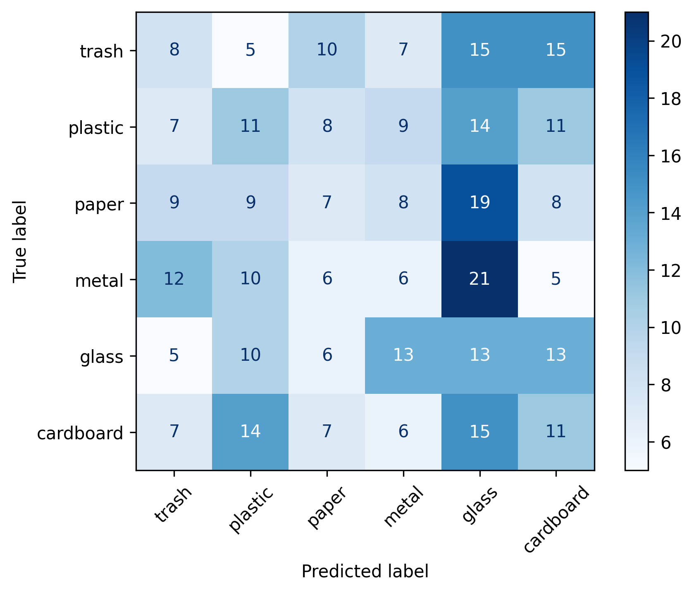

# 🗑️ Garbage Classifier

A deep learning model that classifies garbage images into **6 categories**:  
`trash`, `plastic`, `paper`, `metal`, `glass`, `cardboard`  

Built with **TensorFlow / Keras** using **MobileNetV2 transfer learning** and fine-tuning.

---

## 📊 Dataset
- **Source:** Custom garbage dataset (`/images/` folder in Google Drive)  
- **Samples per class:** 300 (balanced dataset)  
- **Split:** 80% training / 20% validation  
- **Augmentation:** rotation, zoom, shift, shear, horizontal flip  

---

## 🧠 Model Architecture
- **Base Model:** MobileNetV2 (pretrained on ImageNet)  
- **Fine-tuned:** Top 50 layers unfrozen  
- **Classifier Head:**  
  - Global Average Pooling  
  - Dense(256, ReLU)  
  - Dropout(0.4)  
  - Dense(6, Softmax)  

Optimizer: **Adam (lr=1e-4)**  
Loss: **Categorical Crossentropy**  
Metrics: **Accuracy**

---

### Accuracy & Loss Curves

  
  

### Confusion Matrix

### Key Observations
- The model achieves **73.89% validation accuracy**, but the **macro F1-score (0.15)** shows poor balance across classes.  
- This suggests the model tends to predict certain classes more often while struggling with others.  
- Future improvements should focus on **class balance, better augmentation, and experimenting with alternative architectures** (ResNet, EfficientNet).

---

## ⚡ Challenges & Solutions
- **Challenge:** Dataset imbalance  
  ✅ Capped samples at 300/class and used augmentation  

- **Challenge:** Overfitting after ~5 epochs  
  ✅ Added Dropout + Early Stopping  

---

## 🔧 Possible Improvements

Although the model achieved good validation accuracy, there are ways to further improve:

1. **Increase Dataset Size**  
   - Collect more images per class (especially real-world garbage samples).  
   - Apply more diverse augmentations (brightness, contrast, blur).

2. **Try Different Architectures**  
   - Test EfficientNet, ResNet50, or DenseNet for potentially better feature extraction.  

3. **Hyperparameter Tuning**  
   - Adjust learning rate, batch size, and dropout rates.  
   - Use learning rate schedulers or optimizers like AdamW.

4. **Class Balancing**  
   - Ensure equal representation of all classes.  
   - Use oversampling or synthetic data generation (SMOTE for images, GANs).

5. **Cross-Validation**  
   - Train with K-fold cross-validation to reduce variance and get a more reliable estimate.  

6. **Model Deployment (Future Work)**  
   - Convert to TensorFlow Lite for edge devices.  
   - Wrap in a Streamlit or Flask app for easy user interaction.

